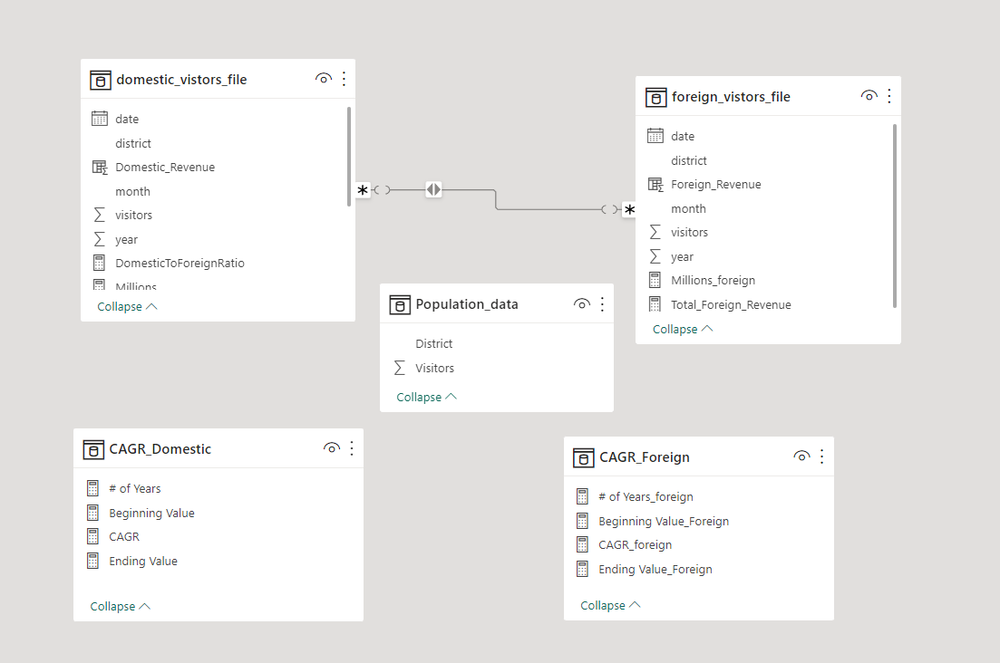

# Telangana Government Tourism Department

Tourism is a significant contributor to many countries' economies, providing jobs and generating revenue. Governments worldwide are constantly seeking ways to enhance their tourism sectors, and one way they do this is by making data available to the public. In recent years, the open data movement has gained momentum, and governments have increasingly published their data in a transparent and accessible manner. Telangana, one of India's leading states, is one such example, and has published its tourism data under its open data policy. This data includes information related to revenue and municipal administration, which can be a valuable resource for businesses and researchers looking to analyze and improve the state's tourism industry. Telangana is promoting transparency and collaboration and encouraging innovation and growth in the tourism industry. In this way, open data policies can play a crucial role in driving economic growth and development


## Project Flow Steps 

* <p><a href="#link1">Business Requirement Document & Data Gathering</a></p>
* <p><a href="#link2">Problem Statement</a></p>
* <p><a href="#link3">Main Goal</a></p>
* <p><a href="#link4">Data Cleaning / Data Transformation</a></p>
* <p><a href="#link5">DAX</a></p>
* <p><a href="#link6">Conclusion / Insights </a></p>


# <h2 id="link1">Business Requirement Document and Data Gathering</h2>
<br>

First Task is to __Merge all individual CSV files in "domestic_visitors" and "foreign_visitors" folders__ using a data integration tool such as Pandas or PowerBI, and name the resulting files "domestic_visitors.csv" and "foreign_visitors.csv", respectively, containing all data from 2016 to 201
The project involves analyzing the research questions and recommendations provided in the document ‘research_questions_and_recommendations.pdf’. The analysis should be conducted using any relevant tool, such as Python, SQL, PowerBI, Tableau, Excel, or PowerPoint.

* __Project Objectives:__

* To answer the research questions provided in the document.
* To provide recommendations based on the findings of the analysis.
* To use relevant tools to conduct the analysis.

* __Scope of the Project:__

* The analysis will be based on the research questions and recommendations provided in the document ‘research_questions_and_recommendations.pdf’.
* Any tool that is relevant to the analysis can be used.
* The project will be completed within the assigned timeframe


The input file given to us contains all the meta information regarding the columns described in the CSV files. we have provided 2 CSV files:


1. __domestic_visitors.csv__: contains data about visitors who travel within the country(India) to 'Telangana' districts for various purposes, such as tourism,business, visiting friends and family.
                        
2. __foreign_visitors.csv:__ contains data about international visitors, referring to individuals who travel from one country  to another for various purposes such as tourism, business, education, or visiting friends and family.


To know more about Table details. Kindly visit to __meta_data.txt__

<br>

<br>

# <h2 id="link2">Problem Statment</h2>
<br>
The Telangana government is seeking ways to increase revenue by improving its administrative operations in the tourism sector. To achieve this, they require a data-informed strategy that will identify patterns in the available data and provide recommendations to guide their efforts.

<br>

# <h2 id="link3">Main Goal</h2>
<br>

The goal of this project is to provide the Telangana government with data-informed recommendations to improve their administrative operations in the tourism sector. The project will be led by data analyst Peter Pandey, who will analyze the available data and conduct additional research to identify patterns and provide recommendations. The recommendations will be based on primary and secondary research questions framed by Peter Pandey, and will be aimed at increasing revenue for the Telangana government by improving administrative operations. The project will use any relevant tools, such as Python, SQL, PowerBI, Tableau, Excel, or PowerPoint, to conduct the analysis and provide recommendations. The ultimate goal is to help the Telangana government make data-informed decisions that will lead to increased revenue and growth in the tourism sector.

<br>

# <h2 id="link4">Data Cleaning / Data Transformation</h2>

The process of data cleaning and transformation is a __crucial step in preparing data__ for analysis. In domestic and foreign tables, the data type of visitors is in strings, but their actual data type should be a whole number. Therefore, I converted it to a whole number. After the conversion, there were null values in the data. As this represents the number of visitors visiting a specific district, null means zero. Therefore, I replaced all null values with 0.

<br>

__Tables are__


<br>

# <h2 id="link5">DAX</h2>

Data Analysis Expressions (DAX) is a programming language that is used throughout Microsoft Power BI for creating calculated columns, measures, and custom tables. It is a collection of functions, operators, and constants that can be used in a formula, or expression, to calculate and return one or more values.

__Measure__

1. __CAGR (Compound Annual Growth Rate) Domestic Table and the measures I used are :__

* #_of_Years Measure and the formula is : 
```
# of Years = (MAX('domestic_vistors_file'[year]) -MIN('domestic_vistors_file'[year]))
```

* Beginning Value Measure and the formula is : 
```
Beginning Value = CALCULATE(SUM('domestic_vistors_file'[visitors]),FILTER('domestic_vistors_file','domestic_vistors_file'[year]=MIN('domestic_vistors_file'[year])))

```
* Ending Value_Foreign Measure and the formula is : 
```
Ending Value = CALCULATE(SUM('domestic_vistors_file'[visitors]),FILTER('domestic_vistors_file','domestic_vistors_file'[year]=MAX('domestic_vistors_file'[year])))

```


* CAGR Measure and the formula is : 
```
CAGR = IFERROR( ([Ending Value]/[Beginning Value])^(1/[# of Years])-1 , 0)

```

2.__CAGR (Compound Annual Growth Rate) Foreign Table and the measures I used are :__

* #_of_Years Measure and the formula is : 
```
# of Years_foreign = (MAX('foreign_vistors_file'[year]) -MIN('foreign_vistors_file'[year]))
```

* Beginning Value Measure and the formula is : 
```
Beginning Value_Foreign = CALCULATE(SUM('foreign_vistors_file'[visitors]),FILTER('foreign_vistors_file','foreign_vistors_file'[year]=MIN('foreign_vistors_file'[year])))

```

* Ending Value_Foreign Measure and the formula is : 
```
Ending Value_Foreign = CALCULATE(SUM('foreign_vistors_file'[visitors]),FILTER('foreign_vistors_file','foreign_vistors_file'[year]=MAX('foreign_vistors_file'[year])))

```

* CAGR Measure and the formula is : 
```
CAGR_foreign = IFERROR( ([Ending Value_Foreign]/[Beginning Value_Foreign])^(1/[# of Years_foreign])-1 , 0)

```


3. __Domestic Table Measures and Calculated Columns__

* Domestic_Revenue column and the formula is : 
```
Domestic_Revenue = 'domestic_vistors_file'[visitors] * 1200.
```

* DomesticToForeignRatio Measure and the formula is : 
```
DomesticToForeignRatio = DIVIDE(domestic_vistors_file[TotalDomesticVisitors], domestic_vistors_file[TotalForeignVisitors])
```

* PopulationToTouristRatio Measure and the formula is : 
```
PopulationToTouristRatio = DIVIDE(domestic_vistors_file[TotalVisitors], domestic_vistors_file[TotalPopulation])
```

* Total Revenue Measure and the formula is : 
```
Total Revenue = SUM('domestic_vistors_file'[Domestic_Revenue])
```

* Total Revenue Measure and the formula is : 
```
Total Revenue = SUM('domestic_vistors_file'[Domestic_Revenue])
```

* TotalDomesticVisitors Measure and the formula is : 
```
TotalDomesticVisitors = CALCULATE(SUM(domestic_vistors_file[visitors]))
```

* TotalForeignVisitors Measure and the formula is : 
```
TotalForeignVisitors = CALCULATE(SUM(foreign_vistors_file[visitors]))
```

* TotalPopulation Measure and the formula is : 
```
TotalPopulation = SUM(Population_data[Visitors])
```

4. __Foreign Table Measures and Calculated Columns__

* Foreign_Revenue  Measure and the formula is : 
```
Foreign_Revenue = 'foreign_vistors_file'[visitors] * 5600
```
* Total_Foreign_Revenue  Measure and the formula is : 
```
Total_Foreign_Revenue = SUM('foreign_vistors_file'[Foreign_Revenue])
```

As these are all the DAX formulas that I used for that project, the pbix file is attached in the repository with name __Tourism_Insights_file.pbix__. I have created different pages for each ad hoc request, so please check it


# <h2 id="link6">Insights for Telanagena Government </h2>

* __Hyderabad: highest visitor percentage (29.25%).__

* __Rajanna Sircilla: 14.56%, Warangal (Urban): 10.71%, Yadadri Bhongir: 9.37%.__

* __Bhadradri Kothagudem: 21.6 million visitors.__

* __Mancherial: highest CAGR (225.80%).__

* __Hyderabad: highest foreign CAGR (24.96%).__

* __Jogulamba Gadwal, Nagarkurnool: high foreign CAGRs, low visitor counts.__

* __Hyderabad peak season: June, December; low season: September, October.__

* __Foreign visitor peak season: December, September; low season: April, May.__

* __Top 3 districts: higher domestic tourists; bottom 3: higher foreign tourists.__

* __Hyderabad: 83.9 million visitors in 2019.__

* __Forecast 2025: domestic tourists: 23.4 million, foreign tourists: 0.25 million.__

* __Avg. revenue: domestic: INR 1,200, foreign: INR 5,600.__

* __High growth potential: Mulugu, Wanaparthy, Siddipet, Nagarkurnool, Nalgonda.__

* __Hyderabad tourism revenue (2016-2019): domestic: INR 100.67 billion, foreign: INR 5.93 billion.__

* __Projected foreign tourism revenue (2025): INR 1.41 billion.__

* __No tourists: Kamareddy, Medchal, Ranga Reddy, Suryapet, Vikarabad.__

* __Target small districts for tourism development.__

* __Events to attract visitors: cultural festivals, conferences, sports, art/film festivals, eco-tourism.__

* __Best event months: domestic: Sept-Oct, foreign: April-May.__

* __Focus districts for tourism development: Hyderabad, Bhadradri Kothagudem, Rajanna Sircilla, Warangal (Rural), Mancherial, Jogulamba Gadwal, Nagarkurnool, Kamareddy, Medchal, Ranga Reddy, Suryapet, Vikarabad.__

* __Strategies to increase foreign revenue: targeted marketing, improved facilities/services, tourism packages, private sector collaboration
Learn from Dubai: infrastructure, business-friendly environment, economic diversification, SEZs, innovation culture, skilled workforce, strong marketing.__

<br>

### AUTHOR
<hr>
<strong>Shehryar Gondal</strong>


You can get in touch with me on my LinkedIn Profile:<br>
 <a href = "https://linkedin.com/in/shehryar-gondal-data-analyst"></a>

You can also follow my GitHub Profile to stay updated about my latest projects:<br>
<a href = "https://github.com/ShehryarGondal1"></a>


If you liked the repo then kindly support it by giving it a star ⭐.